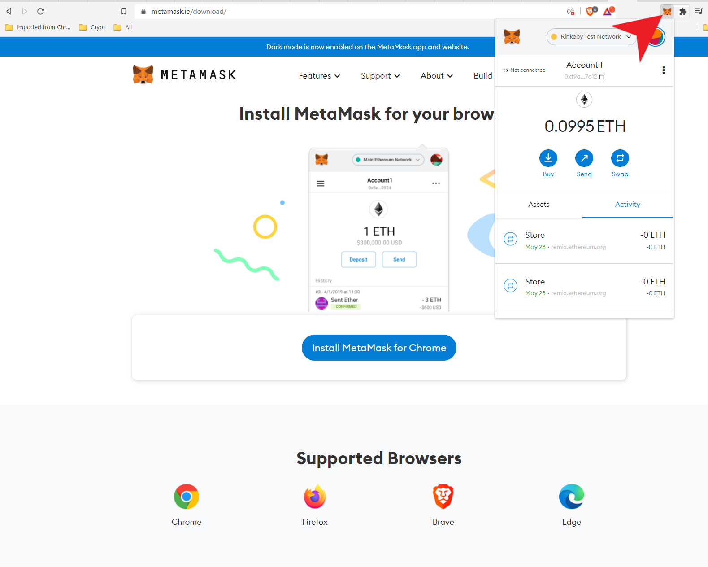

# EtheriumNFTCreationGuide
A step by step on the creation of NFTS as well as some answers to common development questions

There are a million guides out there. Writting my own to cement my own understanding

## Questions to answer
- How to create a new project
- How to unit test
- How to deploy to a test network
- How to deploy to the main net
- How to integrate a web application with our contract
- How to run the entire workflow locally
- How to create a metamask account, and why?
- What are Etherium protocals, which one should I choose
- How much will this cost? An explanation of Gas

## Learning Resources
### Etherium Devlopment
- Offical Documentation: https://ethereum.org/en/developers/docs/

### Solidity
- Offical Documentation: https://docs.soliditylang.org/en/v0.8.14/#
- Best Tutorial: https://cryptozombies.io/
- Another solid one: https://hackingthemarkets.com/

## Tooling
### Frameworks
Most common Frameworks are **Truffle**, **Hardhat**, and **Remix**

**Truffle** and **Hardhat** are node.js libraries that can be installed via package managers. **See included .md files with Truffle and Hardhat guides.**

**Remix** is an all in one framework delivered through an internet browser.

The community's difficulty curve consensus from easiest to hardest seems to be
 - **Remix => Truffle => Hardhat**

Where Remix is great for quickly prototyping out a smart contract or for newer people learning and exploring concepts

And Truffle/Hardhat are better when building out more complex contracts as they include useful tools that allow for debugging, the ever powerful **console.log()**, and more. 

All three have plugin support that can fill in the holes of missing functionality.

- Heres a good [article](https://theblockchainguy.dev/hardhat-vs-truffle-vs-remix) that outlines the differences further

All three have roughly the same user popularity percentages, are well documented, and can used for most use cases so it really comes down to preference.

### IDEs
- Remix
    - [Link To Page](https://remix.ethereum.org/#optimize=false&runs=200&evmVersion=null&version=soljson-v0.8.7+commit.e28d00a7.js)
    - [Solid Tutorial](https://www.youtube.com/watch?v=bZKVfXmzRDw&ab_channel=ArturChmaro)
    - Very user friendly and great for beginners
    - Supported right in your web browser so no additional tools needed

- Visual Studio Code
    - Good option for Truffle or Hardhat projects
    - There are a variety of useful plugins for solidity development including specific ones for Truffle/Hardhat

### My Current Favorite Combo:
 - HardHat + Visual Studio Code
    -
    
### Wallets
Every time you interact with a smart contract including deploying it, you need to pay a gas fee.

On the main net its paid in Ethereum and  on test networks its fake currency.

Furthermore all interactions with a contract are made by an **Account** which acts as a "user" for the application.

Both the account and funds required to operate on the blockchain are housed in a **Wallet**

The most popular tool to use for creating and managing your Ethereum wallet is **Metamask**

- Site: https://metamask.io/

Metamask is a free to use browser extension available on most popular browsers.

Most Web3 websites (dApps) use node.js libraries that will automatically integrate with Metamask and handle all communication between your wallet and the blockchain.

Here is a [tutorial](https://www.youtube.com/watch?v=tw-tQD0jztE&ab_channel=MoneyZG) on creating, funding, and using your Metamask Wallet.

**IMPORTANT:** This and every tutorial will emphasize it, but never ever share your seed phrase that you used to create your wallet WITH ANYONE. Even if the CEO of Metamask himself asks you for it. Although some of the crypto theft you hear about comes from poorly written smart contracts, a large amount of scams come from phishing attempts where the scammer tricks people into providing this seed phrase. (Very common in the NFT gold rush with less technical folks being taken advantage of)

### Steps to getting contract on the block chain
 1. Write code
 2. Compile code
 3. Compiled code is stored in Project Artifacts
 4. Test Code, unit tests reference compiled code in Artifacts
 5. Deploy code to actual test networks such as Rinkeby and validate
 6. Finally Deploy to Main net

 ### View your contract on the block chain
 You can view important details about deployed Smart Contracts or even individual Wallet Accounts such as Ether balances and transaction histories through tools called Block Explorers. This includes Test Networks! The most popular for the Ethereum network is Etherscan.
 - Etherscan
    - Main Net: https://etherscan.io/
    - Rinkeby Test Network: https://rinkeby.etherscan.io/

## Test Networks
### Options
 - Rinkeby
### Faucets
Faucets are sites you can visit to receive free testing currency for test networks

## How to make a website interact with the block chain

### Libraries
 - web3.js
    - [Repo](https://github.com/ChainSafe/web3.js#readme)
    - [Documentation](https://web3js.readthedocs.io/en/v1.7.3/)
 - ethers.js
    - [Repo](https://github.com/ethers-io/ethers.js#readme)
    - [Documentation](https://docs.ethers.io/v5/)
 - Comparison and example usage [here](https://www.youtube.com/watch?v=DdyXocqnCxE&ab_channel=DappUniversity)
